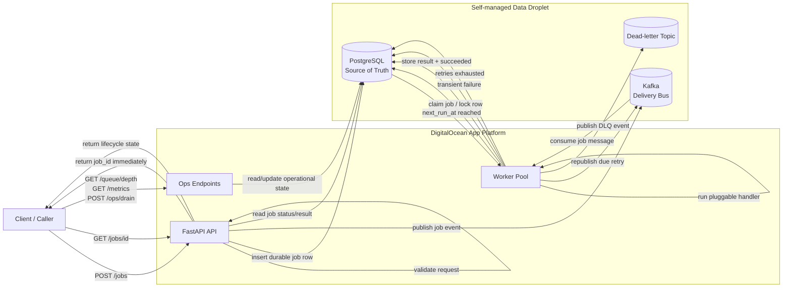

# Async Job Processing Pipeline Service

Production-candidate FastAPI service for asynchronous job submission, execution, retry, dead-lettering, and lifecycle visibility.

## Architecture



- FastAPI API accepts jobs and returns a job ID immediately.
- PostgreSQL stores authoritative job state, attempts, idempotency keys, results, drain mode, and dead-letter state.
- Kafka transports submitted/retry/dead-letter job events between API and workers.
- Worker processes consume Kafka messages, verify PostgreSQL state, execute handlers, and update results.
- Failed attempts remain visible as `failed` while waiting for retry; exhausted jobs move to `dead_lettered`.
- DigitalOcean App Platform runs the API and worker components. PostgreSQL and Kafka can be self-maintained for the timed MVP.

For a code-review walkthrough with the major design choices and trade-offs, see [`CODE_REVIEW.md`](CODE_REVIEW.md).

## Code Layout

```text
app/
  api/        FastAPI dependency wiring
  core/       config, errors, shared enums
  db/         SQLAlchemy models and database session setup
  jobs/       job schemas, service logic, handlers, scheduling, repositories
  queue/      Kafka producer abstractions
  main.py     FastAPI app factory and routes
  worker.py   Kafka worker process
```

## Local Setup

```bash
python -m venv .venv
source .venv/bin/activate
pip install -r requirements.txt
cp .env.example .env
docker compose up -d db kafka
uvicorn app.main:app --host 0.0.0.0 --port 8000
```

Run a worker in a second shell:

```bash
python -m app.worker
```

## Tests

```bash
pytest
```

Unit and API tests use an in-memory repository and fake Kafka producer so the fast test suite does not require live PostgreSQL or Kafka. Integration testing can use `docker compose`.

Optional live integration test:

```bash
RUN_INTEGRATION=1 pytest tests/test_integration.py
```

## API

- `GET /healthz`
- `GET /readyz`
- `POST /jobs`
- `GET /jobs/{job_id}`
- `GET /jobs`
- `GET /queue/depth`
- `GET /metrics`
- `POST /jobs/{job_id}/cancel`
- `POST /ops/drain`
- `GET /ops/drain`

Example job submission:

```bash
curl -X POST http://localhost:8000/jobs \
  -H "Content-Type: application/json" \
  -d '{"handler":"echo","payload":{"message":"hello"},"priority":5,"max_retries":3,"timeout_seconds":30}'
```

Delayed and recurring job submission:

```bash
curl -X POST http://localhost:8000/jobs \
  -H "Content-Type: application/json" \
  -d '{"handler":"echo","payload":{"message":"hello"},"run_at":"2026-06-22T18:00:00Z","recurring_cron":"*/5 * * * *"}'
```

The MVP cron parser supports five-field cron expressions with `*`, `*/n`, or exact numeric values.

Supported MVP handlers:

- `echo`: returns the submitted payload.
- `always_fail`: raises a transient error for retry/dead-letter testing.
- `fail_once`: test helper handler.
- `sleep`: test helper handler for timeout behavior.

## Observability

`GET /metrics` returns:

- job success/failure counts and rates
- retry count
- dead-letter count
- job latency p50/p95 in seconds
- worker utilization derived from running vs pending jobs

## Configuration

Important runtime variables:

- `DATABASE_URL`
- `KAFKA_BOOTSTRAP_SERVERS`
- `KAFKA_SUBMITTED_HIGH_TOPIC`
- `KAFKA_SUBMITTED_DEFAULT_TOPIC`
- `KAFKA_SUBMITTED_LOW_TOPIC`
- `KAFKA_RETRY_TOPIC`
- `KAFKA_DEAD_LETTER_TOPIC`
- `MAX_PAYLOAD_BYTES`
- `MAX_PAGE_SIZE`
- `WORKER_ID`

Deployment-only variables:

- `DIGITALOCEAN_ACCESS_TOKEN`
- `DO_APP_NAME`, optional, defaults to `async-job-pipeline`
- `DO_APP_REGION`, optional, defaults to `nyc`
- `DO_INFRA_REGION`, optional, defaults to `nyc1`

Never commit real tokens or credentials.

## Deployment

The repo includes Terraform configuration under `infra/terraform/`, a DigitalOcean App Platform spec template at `infra/app.yaml`, and a one-shot deployment script at `scripts/deploy.sh`.

Terraform provisions a self-managed infrastructure Droplet that runs PostgreSQL and Kafka with Docker. The App Platform spec defines the application deployment shape: API component, worker component, Dockerfile build strategy, run commands, health check, route, instance sizes/counts, and runtime environment variables.

```bash
export DIGITALOCEAN_ACCESS_TOKEN=...
./scripts/deploy.sh
```

The script infers the GitHub repo and branch from the local git checkout, provisions the self-managed PostgreSQL/Kafka Droplet with Terraform, renders `infra/app.yaml` with the generated connection details, and creates or updates the App Platform app.

Terraform alternative:

```bash
cd infra/terraform
cp terraform.tfvars.example terraform.tfvars
# edit terraform.tfvars only if you want to run Terraform directly; do not commit it
terraform init
terraform apply
```

Pause before running deployment until the DigitalOcean token is available.

Smoke test after deploy:

```bash
./scripts/smoke.sh https://<app-url>
```

Full feature demo after deploy:

```bash
./scripts/demo.sh https://<app-url>
```

The demo script walks through health/readiness, job submission, idempotency, successful processing, delayed cancellation, timeout/dead-letter behavior, handler failure/dead-letter behavior, drain mode, queue depth, recent jobs, and metrics. Recurring jobs are opt-in to avoid leaving scheduled demo work running:

```bash
RUN_RECURRING_DEMO=1 ./scripts/demo.sh https://<app-url>
```

## High Load Notes

- Scale API replicas and worker replicas independently on App Platform.
- Increase Kafka partitions for more worker parallelism.
- Keep PostgreSQL indexes on job status, retry timing, and created time.
- Keep handlers idempotent because Kafka and worker processing are at-least-once.
- Add transactional outbox before depending on strict DB-to-Kafka publish recovery.
- Add managed PostgreSQL/Kafka, metrics, tracing, rate limiting, and retention cleanup for production hardening.
