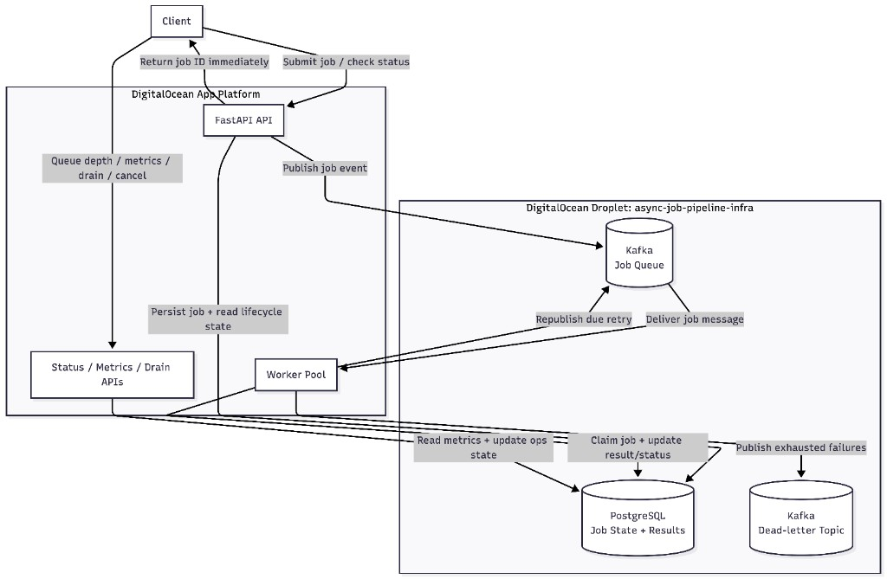
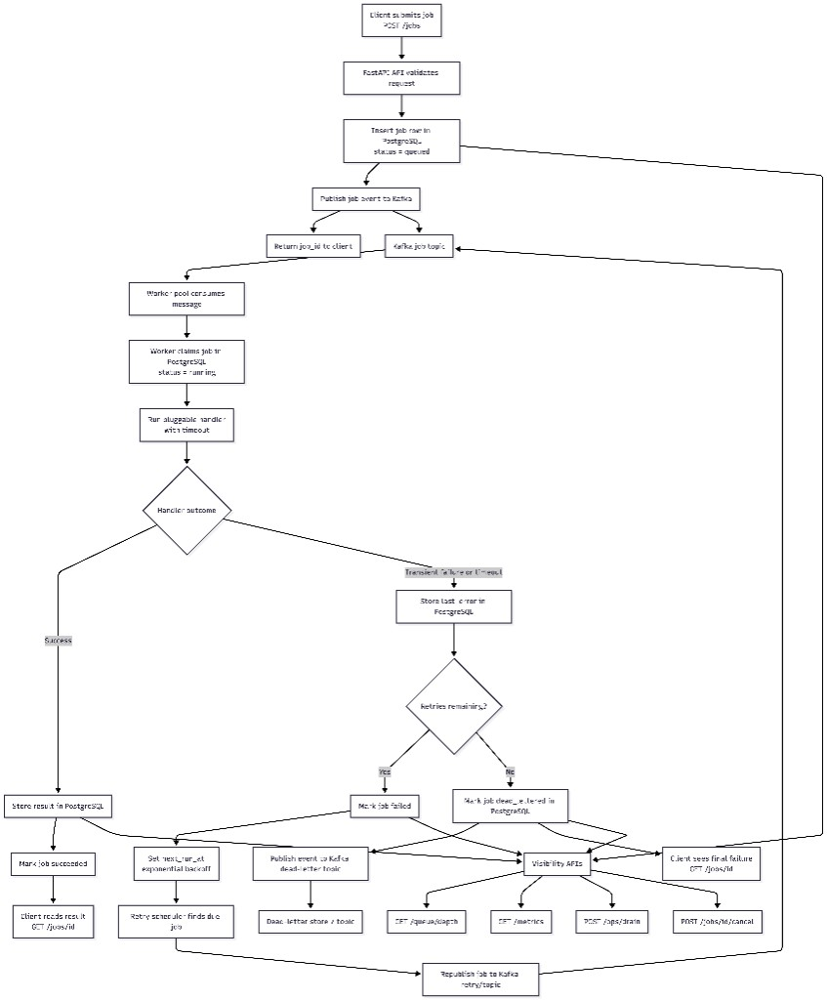

# Async Job Processing Pipeline Service

Production-candidate FastAPI service for asynchronous job submission, execution, retry, dead-lettering, and lifecycle visibility.

## Architecture

High-level DigitalOcean deployment:



Full job lifecycle, including retry and dead-letter flow:



- FastAPI API accepts jobs and returns a job ID immediately.
- PostgreSQL stores authoritative job state, attempts, idempotency keys, results, drain mode, and dead-letter state.
- Kafka transports submitted/retry/dead-letter job events between API and workers.
- Worker processes consume Kafka messages, verify PostgreSQL state, execute handlers, and update results.
- Failed attempts remain visible as `failed` while waiting for retry; exhausted jobs move to `dead_lettered`.
- DigitalOcean App Platform runs the API and worker components. PostgreSQL and Kafka can be self-maintained for the timed MVP.

This README is the primary review guide; [`CODE_REVIEW.md`](CODE_REVIEW.md) keeps extra backup notes on trade-offs and tests.

## Code Layout

```text
app/
  api/        FastAPI dependency wiring
  core/       config, errors, shared enums
  db/         SQLAlchemy models and database session setup
  jobs/       job schemas, service logic, handlers, scheduling, repositories
  queue/      Kafka producer abstractions
  main.py     FastAPI app factory and routes
  worker.py   Kafka worker process
```

## Local Setup

Start PostgreSQL and Kafka locally, then run the API and worker as separate processes:

```bash
python -m venv .venv
source .venv/bin/activate
pip install -r requirements.txt
cp .env.example .env
docker compose up -d db kafka
uvicorn app.main:app --host 0.0.0.0 --port 8000
```

Run a worker in a second shell:

```bash
python -m app.worker
```

The API should be reachable at `http://localhost:8000`. Use `GET /healthz` for liveness and `GET /readyz` to confirm the API can reach PostgreSQL and Kafka.

## Tests

```bash
pytest
```

Unit and API tests use an in-memory repository and fake Kafka producer so the fast test suite does not require live PostgreSQL or Kafka. Integration testing can use `docker compose`.

Optional live integration test:

```bash
RUN_INTEGRATION=1 pytest tests/test_integration.py
```

Test coverage to show in review:

- `tests/test_api.py`: health/readiness, create/get/list jobs, idempotency, validation errors, unsupported handlers, queue depth, drain mode, cancellation, and metrics.
- `tests/test_service.py`: worker success, duplicate Kafka message skip, transient retry, dead-letter after retry exhaustion, timeout handling, recurring job creation, drain behavior, due-job republish, and Kafka publish failure.
- `tests/test_integration.py`: opt-in live PostgreSQL/Kafka scaffold for end-to-end validation.
- `.github/workflows/ci.yml`: runs `pytest` on every push and pull request.

## API

- `GET /healthz`
- `GET /readyz`
- `POST /jobs`
- `GET /jobs/{job_id}`
- `GET /jobs`
- `GET /queue/depth`
- `GET /metrics`
- `POST /jobs/{job_id}/cancel`
- `POST /ops/drain`
- `GET /ops/drain`

Example job submission:

```bash
curl -X POST http://localhost:8000/jobs \
  -H "Content-Type: application/json" \
  -d '{"handler":"echo","payload":{"message":"hello"},"priority":5,"max_retries":3,"timeout_seconds":30}'
```

Delayed and recurring job submission:

```bash
curl -X POST http://localhost:8000/jobs \
  -H "Content-Type: application/json" \
  -d '{"handler":"echo","payload":{"message":"hello"},"run_at":"2026-06-22T18:00:00Z","recurring_cron":"*/5 * * * *"}'
```

The MVP cron parser supports five-field cron expressions with `*`, `*/n`, or exact numeric values.

Supported MVP handlers:

- `echo`: returns the submitted payload.
- `always_fail`: raises a transient error for retry/dead-letter testing.
- `fail_once`: test helper handler.
- `sleep`: test helper handler for timeout behavior.

## Functional Expectations Walkthrough

Use this section during review to show each required behavior quickly.

Job submission:

- Show `POST /jobs` in `app/main.py` and `JobCreate` in `app/jobs/schemas.py`.
- Show `JobService.submit_job()` in `app/jobs/service.py`: validates handler/payload size, creates the PostgreSQL job row, publishes a Kafka job event, and returns the job ID.
- Demo: `scripts/demo.sh` section `Submit an echo job and prove idempotency`.
- Key point: processing is decoupled because the API returns after durable insert and Kafka publish, not after handler execution.

Worker execution:

- Show `app/worker.py`: worker consumes Kafka topics, sorts by priority topic, processes messages, and commits offsets after processing.
- Show `JobService.process_job()` in `app/jobs/service.py`: claims the job, runs the handler with timeout, stores success, schedules retry, or dead-letters.
- Show `claim_job()` and `mark_failed_attempt()` in `app/jobs/repositories.py`: PostgreSQL guards state transitions and retry exhaustion.
- Demo: `scripts/demo.sh` sections `Force a timeout` and `Force a handler failure`.
- Key point: workers are at-least-once; duplicate Kafka messages are bounded by PostgreSQL claim/state checks.

Status and result API:

- Show `GET /jobs/{job_id}` in `app/main.py` and `JobResponse` in `app/jobs/schemas.py`.
- Response includes current state, attempt count, max retries, timeout, `last_error`, `result`, `next_run_at`, and timestamps.
- Demo: `scripts/demo.sh` section `Poll until the echo job succeeds`.
- Key point: PostgreSQL is the source of truth for lifecycle visibility.

Visibility and drain:

- Show `GET /queue/depth`, `GET /metrics`, `POST /ops/drain`, and `POST /jobs/{job_id}/cancel` in `app/main.py`.
- Show queue depth, metrics, drain, and cancellation logic in `app/jobs/repositories.py`.
- Demo: `scripts/demo.sh` sections `Submit a delayed job and cancel it`, `Toggle drain mode`, and `Final queue depth, recent jobs, and metrics`.
- Key point: operators can inspect backlog, pause new claims, cancel pending work, and monitor success/failure behavior.

## Observability

Runtime endpoints:

- `GET /healthz`: process liveness.
- `GET /readyz`: PostgreSQL and Kafka readiness.
- `GET /queue/depth`: queued, due, running, dead-lettered, and queued-by-priority counts.
- `GET /metrics`: structured job metrics computed from PostgreSQL state.

`GET /metrics` returns:

- `job_success_count` and `job_failure_count`.
- `job_success_rate` and `job_failure_rate`.
- `retry_count` and `dead_letter_count`.
- `job_latency_p50_seconds` and `job_latency_p95_seconds`.
- `worker_utilization` derived from running vs pending jobs.

Review note: metrics are computed from the authoritative job table on demand. For production, export these to Prometheus/OpenTelemetry/Grafana or Datadog for historical dashboards, alerting, and time-windowed rates.

## Configuration

Important runtime variables:

- `DATABASE_URL`: SQLAlchemy PostgreSQL connection string.
- `KAFKA_BOOTSTRAP_SERVERS`: Kafka broker list, for example `localhost:9092`.
- `KAFKA_SUBMITTED_HIGH_TOPIC`: high-priority submitted job topic.
- `KAFKA_SUBMITTED_DEFAULT_TOPIC`: default-priority submitted job topic.
- `KAFKA_SUBMITTED_LOW_TOPIC`: low-priority submitted job topic.
- `KAFKA_RETRY_TOPIC`: retry topic used when due jobs are republished.
- `KAFKA_DEAD_LETTER_TOPIC`: dead-letter topic for exhausted jobs.
- `MAX_PAYLOAD_BYTES`: maximum serialized job payload size.
- `MAX_PAGE_SIZE`: maximum API pagination limit.
- `WORKER_ID`: worker identity stored on claimed jobs.

Worker-specific variables:

- `WORKER_ID`, default `worker-local`: identifies which worker claimed a job.
- `WORKER_BATCH_SIZE`, default `10`: maximum number of due queued/failed jobs the worker republishes per scheduler pass.
- `WORKER_POLL_INTERVAL_SECONDS`, default `1`: Kafka poll interval and due-job scheduler cadence.
- `STALE_LOCK_SECONDS`, default `300`: intended threshold for stale running locks in production hardening.

Worker scaling:

- Run more worker processes locally with additional `python -m app.worker` shells.
- In DigitalOcean App Platform, increase `WORKER_INSTANCE_COUNT` before running `scripts/deploy.sh`.
- API and worker components are separate, so increasing workers does not require scaling API replicas.
- Kafka partition count controls how much parallelism workers can use for submitted/retry topics.

Deployment-only variables:

- `DIGITALOCEAN_ACCESS_TOKEN`
- `DO_APP_NAME`, optional, defaults to `async-job-pipeline`
- `DO_APP_REGION`, optional, defaults to `nyc`
- `DO_INFRA_REGION`, optional, defaults to `nyc1`

Never commit real tokens or credentials.

## Deployment

The repo includes Terraform configuration under `infra/terraform/`, a DigitalOcean App Platform spec template at `infra/app.yaml`, and a one-shot deployment script at `scripts/deploy.sh`.

Terraform provisions a self-managed infrastructure Droplet that runs PostgreSQL and Kafka with Docker. The App Platform spec defines the application deployment shape: API component, worker component, Dockerfile build strategy, run commands, health check, route, instance sizes/counts, and runtime environment variables.

```bash
export DIGITALOCEAN_ACCESS_TOKEN=...
./scripts/deploy.sh
```

The script infers the GitHub repo and branch from the local git checkout, provisions the self-managed PostgreSQL/Kafka Droplet with Terraform, renders `infra/app.yaml` with the generated connection details, and creates or updates the App Platform app.

Terraform alternative:

```bash
cd infra/terraform
cp terraform.tfvars.example terraform.tfvars
# edit terraform.tfvars only if you want to run Terraform directly; do not commit it
terraform init
terraform apply
```

Pause before running deployment until the DigitalOcean token is available.

Smoke test after deploy:

```bash
./scripts/smoke.sh https://<app-url>
```

Full feature demo after deploy:

```bash
./scripts/demo.sh https://<app-url>
```

The demo script walks through health/readiness, job submission, idempotency, successful processing, delayed cancellation, timeout/dead-letter behavior, handler failure/dead-letter behavior, drain mode, queue depth, recent jobs, and metrics. Recurring jobs are opt-in to avoid leaving scheduled demo work running:

```bash
RUN_RECURRING_DEMO=1 ./scripts/demo.sh https://<app-url>
```

## Review Trade-offs and Improvements

What is production-minded now:

- Clear module boundaries: API, schemas, service logic, repository/state transitions, Kafka adapter, worker, infra, and tests.
- PostgreSQL is the source of truth for correctness and lifecycle visibility.
- Kafka decouples HTTP submission from worker execution and supports independent worker scaling.
- Workers use at-least-once semantics and re-check PostgreSQL state before execution.
- Errors use consistent JSON responses with request IDs.
- Deployment is repeatable through Terraform, cloud-init, App Spec, and scripts.

Important trade-offs to say out loud:

- Database commit plus Kafka publish is not atomic yet; production should add a transactional outbox and relay.
- Kafka priority is best-effort through high/default/low topics, not strict global priority ordering.
- Metrics are structured JSON from PostgreSQL, not a time-series backend yet.
- PostgreSQL and Kafka are self-managed on a Droplet for MVP speed; production should use managed/private-networked data services.
- Cron support intentionally handles a small five-field subset; production should use a mature scheduler/parser.

Next improvements:

- Add Alembic migrations instead of startup table creation.
- Add Prometheus/OpenTelemetry export, dashboards, and alerts.
- Add full PostgreSQL/Kafka integration services in CI.
- Add auth, rate limiting, remote Terraform state, backups, and retention cleanup.

## Handling High Load

The service is designed so HTTP traffic and background execution can scale separately.

API tier:

- Increase `API_INSTANCE_COUNT` in the deployment environment to add more FastAPI replicas.
- Keep the API stateless; all durable state lives in PostgreSQL and all work delivery goes through Kafka.
- Keep request payloads bounded with `MAX_PAYLOAD_BYTES` and pagination bounded with `MAX_PAGE_SIZE`.
- Add authentication and rate limiting before exposing the service to untrusted clients.

Worker tier:

- Increase `WORKER_INSTANCE_COUNT` to process more jobs concurrently.
- Increase Kafka partitions for the submitted/retry topics when adding many workers; workers cannot use more parallelism than partitions allow.
- Tune `WORKER_BATCH_SIZE` and `WORKER_POLL_INTERVAL_SECONDS` to balance retry latency against database/Kafka load.
- Keep handlers idempotent because Kafka delivery and worker processing are at-least-once.

Database and queue:

- PostgreSQL is the source of truth for job lifecycle state; keep indexes on status, `next_run_at`, priority, and creation time.
- Kafka is the delivery bus; monitor consumer lag and topic partition count as load grows.
- Use managed PostgreSQL/Kafka or a private-networked data plane for production.
- Add a transactional outbox before depending on strict recovery between database commit and Kafka publish.

Observability and operations:

- Use `/queue/depth` and `/metrics` to watch backlog, success/failure rate, dead letters, latency p50/p95, and worker utilization.
- Use `/ops/drain` before maintenance to stop workers from claiming new jobs.
- Add Prometheus/OpenTelemetry, tracing, alerting, and retention cleanup for production hardening.
