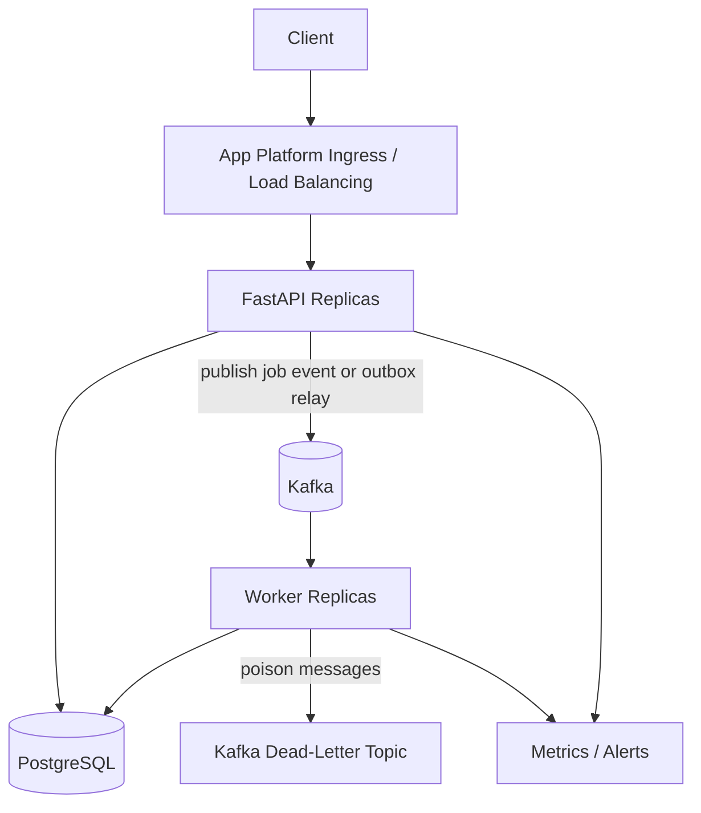

# SPEC.md

## 1. Problem Statement

Build a production-candidate REST API for asynchronous job processing. The service accepts job submissions with a payload and execution parameters, persists the job durably, returns a job ID immediately, and lets separate workers execute jobs outside the HTTP request path. Callers can query job lifecycle state, result payloads, errors, attempt counts, queue depth, and operational drain/cancel controls. Correctness means submitted jobs are durably tracked in PostgreSQL, workers execute eligible jobs with bounded at-least-once semantics, retries and timeouts are visible, and jobs that exceed retry limits are moved to a dead-letter state instead of disappearing.

## 2. Requirements and Scale Inputs

Functional requirements:

- Submit jobs with a payload and scheduling parameters: `priority`, `max_retries`, `timeout_seconds`, and optionally `run_at`.
- Return a job ID immediately; job execution must be decoupled from the HTTP response.
- Workers pull jobs from a queue and execute a pluggable handler.
- Support transient failure handling with exponential backoff.
- Move jobs that fail past `max_retries` to a dead-letter store/state.
- Provide status/result API for state, attempt count, last error, and result payload.
- Provide queue-depth endpoint.
- Provide a mechanism to drain or cancel pending jobs.
- Document at-least-once semantics and duplicate execution boundaries.
- Include an architecture flow diagram.
- Support tests, CI/CD, Docker, and DigitalOcean deployment.
- Support delayed execution and MVP cron-style recurring jobs.
- Support observability for queue depth, worker utilization, latency percentiles, success/failure counts, and dead-letter rate.

Non-functional requirements:

- Python, FastAPI, PostgreSQL, Docker, and docker-compose.
- DigitalOcean App Platform deployment for the API and worker components.
- Self-maintained PostgreSQL and Kafka are acceptable for the MVP because provisioning managed DigitalOcean services can take longer than the interview time box.
- DigitalOcean App Platform ingress/load balancing is the external ingress layer.
- Workers should scale independently of the API tier.
- PostgreSQL is the durable source of truth.
- Kafka is the asynchronous queue transport for submitted and retried jobs.
- GitHub Actions should run the full test suite on push.

Scale inputs:

- No explicit DAU, QPS, jobs/sec, latency, retention, payload size, or burst requirements were provided.
- MVP assumption: low-to-moderate interview load, roughly tens of requests/sec and thousands to low millions of jobs retained, with bounded payloads.
- MVP assumption: API submission latency should be fast because it performs validation and durable insert only, targeting sub-200ms excluding dependency latency.
- MVP assumption: job execution latency depends on handler behavior and is not part of API latency.

Impact of missing scale numbers:

- Synchronous execution is not acceptable because the problem explicitly requires decoupled worker execution.
- Async processing is explicitly required, so the MVP uses Kafka for queue transport and PostgreSQL for durable job state, results, and idempotency.
- Self-maintained Kafka/PostgreSQL in docker-compose keep local development and demo setup fast; production can later move the same contracts to managed services.
- App Platform worker count can start at one and scale horizontally through a Kafka consumer group.
- Pagination is required for list-style endpoints to avoid unbounded responses.
- Retention cleanup is documented as a production improvement.
- Observability starts with structured logs, health/readiness endpoints, queue-depth/status queries, and Kafka consumer lag notes.

## 3. Clarifying Questions

- What job handler types should be supported in the MVP: echo/no-op, HTTP callback, named internal handlers, or arbitrary code execution?
- Should clients provide an idempotency key, or should every submission always create a new job?
- Should duplicate submissions return the existing job or fail with conflict?
- What maximum payload size should the API accept?
- What are valid `priority`, `max_retries`, and `timeout_seconds` bounds?
- Should cancelling a running job attempt be supported, or only pending jobs?
- Should drain stop only new job claims, or also reject new submissions?
- How long should completed, failed, and dead-lettered jobs be retained?
- Is delayed execution required in the MVP, or only as a documented extension?
- Are recurring cron jobs required in the MVP, or only as a documented extension?
- What throughput and latency targets should drive Kafka partition count and worker count?
- Should API authentication be required for operational endpoints?

If unanswered, the MVP assumptions below apply.

## 4. Assumptions

- Jobs use server-generated UUID primary keys.
- Clients may provide an optional `idempotency_key`; when present, it is unique and deduplicates submissions.
- The MVP supports a small pluggable handler registry, starting with an `echo` handler that returns the submitted payload.
- Job execution is asynchronous via an App Platform worker process.
- PostgreSQL is the source of truth for jobs, attempts, results, idempotency, and dead-letter state.
- Kafka is the MVP queue transport between API and workers.
- Local development runs self-maintained PostgreSQL and Kafka with `docker-compose`.
- Deployed demos may point App Platform API/worker components at self-maintained PostgreSQL and Kafka endpoints if managed DigitalOcean provisioning is too slow.
- DigitalOcean App Platform hosts one FastAPI web component and one independently scalable worker component.
- App Platform ingress/load balancing handles external routing for API traffic.
- Workers consume Kafka messages and verify/update authoritative job state in PostgreSQL.
- A transactional outbox is preferred for production reliability; for the interview MVP, the API writes the job row and publishes the Kafka message with idempotent worker processing to tolerate duplicate messages.
- List endpoints are paginated with a default page size and maximum page size.
- Validation happens at the API boundary with Pydantic and in the service layer for domain constraints.
- Duplicate submissions with the same `idempotency_key` return the existing job with `idempotent_replay=true`.
- Cancelling applies to pending/queued jobs in the MVP. Running cancellation is deferred.
- Drain mode prevents workers from claiming additional pending jobs; rejecting new submissions during drain is optional and controlled by configuration.

## 5. Goals

- Accept and validate job submissions.
- Persist job records and payloads in PostgreSQL.
- Return a durable job ID immediately.
- Execute jobs asynchronously through worker processes.
- Track lifecycle states: `queued`, `running`, `succeeded`, `failed`, `dead_lettered`, and `cancelled`.
- Support retry with exponential backoff and timeout semantics.
- Store result payloads, attempt count, and last error.
- Handle idempotent submissions when an idempotency key is provided.
- Expose query endpoints for job status, results, and queue depth.
- Expose operational endpoints for drain control and pending job cancellation.
- Provide `GET /healthz` and `GET /readyz`.
- Support automated tests with pytest and FastAPI TestClient or httpx.
- Support Dockerized local development with PostgreSQL and Kafka.
- Support deployment to DigitalOcean App Platform using externally reachable self-maintained PostgreSQL and Kafka for the timed MVP.
- Document managed-service production evolution separately from the MVP.

## 6. Non-Goals

- Arbitrary untrusted code execution.
- Advanced cron scheduler features beyond simple five-field recurring jobs.
- Complex distributed retry and DLQ infrastructure beyond the required Kafka topics and PostgreSQL state.
- Redis or cache.
- OAuth/RBAC.
- Prometheus/Grafana.
- OpenTelemetry tracing.
- Kubernetes.
- Multi-region deployment.
- Advanced admin UI.
- Complex migration tooling beyond a simple migration command or startup migration for the interview.
- Full load/performance testing.

These are future production improvements unless the interviewer explicitly requires them.

## 7. Architecture Overview

### MVP Architecture

The MVP uses Kafka as the asynchronous queue transport and PostgreSQL as the durable source of truth for job state, attempts, results, idempotency, and dead-letter visibility.

```mermaid
flowchart TD
    Client[Client or Internal Service]
    Ingress[DigitalOcean App Platform Ingress / Load Balancing]
    API[FastAPI Web Service]
    DB[(Self-Maintained PostgreSQL)]
    Kafka[(Self-Maintained Kafka)]
    Worker[App Platform Worker Pool]
    Handler[Pluggable Job Handler]

    Client -->|POST /jobs| Ingress --> API
    API -->|validate + insert queued job| DB
    API -->|publish job_id| Kafka
    API -->|201 job_id| Client

    Worker -->|consume job_id| Kafka
    Worker -->|load + mark running| DB
    Worker -->|execute with timeout| Handler
    Handler -->|result or error| Worker
    Worker -->|succeeded result| DB
    Worker -->|transient failure + backoff| DB
    Worker -->|publish retry message| Kafka
    Worker -->|failed past max_retries| DB
    Worker -->|dead_lettered| DB
    Worker -->|optional dead-letter event| Kafka

    Client -->|GET /jobs/{id}| Ingress --> API --> DB
    Client -->|GET /queue/depth| Ingress --> API --> DB
    Client -->|POST /ops/drain| Ingress --> API --> DB
```

Why this MVP:

- It satisfies the explicit asynchronous queue requirement with Kafka while keeping authoritative state in PostgreSQL.
- Self-maintained Kafka and PostgreSQL avoid waiting for managed-service provisioning during the interview.
- PostgreSQL remains the durable source of truth for job state, retry state, and results.
- Kafka consumer groups let workers scale independently.
- Workers check PostgreSQL status before execution so duplicate Kafka delivery does not create unbounded duplicate processing.
- The API and workers can scale independently on DigitalOcean App Platform.

### Production Architecture

Production evolution keeps the same API, database, and Kafka contracts while replacing self-maintained infrastructure with managed services when provisioning time and operational requirements allow.



Production additions:

- Multiple stateless FastAPI replicas.
- Multiple App Platform worker replicas.
- Managed or dedicated PostgreSQL and Kafka for stronger operational guarantees.
- Transactional outbox if DB insert and Kafka publish must be atomic.
- Retry topic or delayed retry strategy and dead-letter topic.
- Request IDs, structured logs, metrics, and alerts.
- Rate limiting and authentication/authorization for operational endpoints.
- Schema migrations using Alembic or equivalent.

## 8. API Contract

### `GET /healthz`

Purpose: liveness check.

Success response:

```json
{ "status": "ok" }
```

Status codes:

- `200 OK`

### `GET /readyz`

Purpose: readiness check for dependencies.

Success response:

```json
{ "status": "ready", "database": "ok", "kafka": "ok" }
```

Error cases:

- `503 dependency_unavailable` if PostgreSQL or Kafka is unreachable.

### `POST /jobs`

Purpose: submit a job for asynchronous execution.

Request body:

```json
{
  "handler": "echo",
  "payload": { "message": "hello" },
  "priority": 5,
  "max_retries": 3,
  "timeout_seconds": 30,
  "run_at": "2026-06-22T18:00:00Z",
  "idempotency_key": "client-job-123"
}
```

Success response:

```json
{
  "id": "0c4c1e51-8d3d-4a4f-907a-d3cc4d6b9645",
  "status": "queued",
  "idempotent_replay": false
}
```

Status codes:

- `201 Created` for a new job.
- `200 OK` for an idempotent replay that returns the existing job.
- `400 bad_request` for domain validation errors.
- `422 validation_error` for malformed request bodies.
- `503 dependency_unavailable` if PostgreSQL is unavailable.

### `GET /jobs/{job_id}`

Purpose: return current job lifecycle state and result/error data.

Success response:

```json
{
  "id": "0c4c1e51-8d3d-4a4f-907a-d3cc4d6b9645",
  "handler": "echo",
  "status": "succeeded",
  "priority": 5,
  "attempt_count": 1,
  "max_retries": 3,
  "timeout_seconds": 30,
  "run_at": "2026-06-22T18:00:00Z",
  "last_error": null,
  "result": { "message": "hello" },
  "created_at": "2026-06-22T17:50:00Z",
  "updated_at": "2026-06-22T17:50:01Z",
  "processed_at": "2026-06-22T17:50:01Z"
}
```

Status codes:

- `200 OK`
- `404 not_found`

### `GET /jobs`

Purpose: paginated job listing for operational visibility.

Query parameters:

- `status` optional enum filter.
- `handler` optional handler filter.
- `limit` optional, default `50`, max `100`.
- `offset` optional, default `0`.

Success response:

```json
{
  "items": [
    {
      "id": "0c4c1e51-8d3d-4a4f-907a-d3cc4d6b9645",
      "handler": "echo",
      "status": "queued",
      "attempt_count": 0,
      "created_at": "2026-06-22T17:50:00Z"
    }
  ],
  "limit": 50,
  "offset": 0
}
```

Status codes:

- `200 OK`
- `400 bad_request` for invalid filters or pagination values.

### `GET /queue/depth`

Purpose: report queue depth for eligible and pending work.

Success response:

```json
{
  "queued": 12,
  "due": 8,
  "running": 2,
  "dead_lettered": 1,
  "by_priority": [
    { "priority": 10, "queued": 3 },
    { "priority": 5, "queued": 9 }
  ]
}
```

Status codes:

- `200 OK`

### `POST /jobs/{job_id}/cancel`

Purpose: cancel a pending queued job.

Success response:

```json
{
  "id": "0c4c1e51-8d3d-4a4f-907a-d3cc4d6b9645",
  "status": "cancelled"
}
```

Status codes:

- `200 OK`
- `404 not_found`
- `409 conflict` if the job is already running, succeeded, failed, or dead-lettered.

### `POST /ops/drain`

Purpose: enable or disable drain mode so workers stop claiming new queued jobs.

Request body:

```json
{ "enabled": true }
```

Success response:

```json
{ "drain_enabled": true }
```

Status codes:

- `200 OK`
- `400 bad_request`

### `GET /ops/drain`

Purpose: inspect drain mode.

Success response:

```json
{ "drain_enabled": false }
```

Status codes:

- `200 OK`

## 9. Data Model

### `jobs`

Fields:

- `id`: UUID primary key, required.
- `handler`: text, required.
- `payload`: JSONB, required.
- `status`: enum/text, required. Values: `queued`, `running`, `succeeded`, `failed`, `dead_lettered`, `cancelled`.
- `priority`: integer, required, default `0`.
- `max_retries`: integer, required.
- `timeout_seconds`: integer, required.
- `attempt_count`: integer, required, default `0`.
- `next_run_at`: timestamptz, required, default now.
- `run_at`: timestamptz, nullable, used for delayed execution.
- `recurring_cron`: text, nullable, simple five-field cron expression for recurring jobs.
- `locked_by`: text, nullable.
- `locked_at`: timestamptz, nullable.
- `kafka_message_key`: text, nullable, usually the job ID.
- `last_error`: text, nullable.
- `result`: JSONB, nullable.
- `idempotency_key`: text, nullable.
- `created_at`: timestamptz, required.
- `updated_at`: timestamptz, required.
- `processed_at`: timestamptz, nullable.

Constraints and indexes:

- Primary key on `id`.
- Unique partial index on `idempotency_key` where not null.
- Index on `(status, next_run_at, priority desc, created_at)` for queue depth, retries, and delayed jobs.
- Index on `status` for filtering and queue depth.
- Index on `handler` for filtering.
- Index on `created_at` for listing.

### `job_attempts`

Fields:

- `id`: UUID primary key.
- `job_id`: UUID foreign key to `jobs.id`, required.
- `attempt_number`: integer, required.
- `status`: enum/text, required. Values: `running`, `succeeded`, `failed`, `timeout`.
- `started_at`: timestamptz, required.
- `finished_at`: timestamptz, nullable.
- `error`: text, nullable.
- `worker_id`: text, nullable.

Constraints and indexes:

- Foreign key on `job_id`.
- Unique index on `(job_id, attempt_number)`.
- Index on `job_id`.

### `ops_settings`

Fields:

- `key`: text primary key.
- `value`: JSONB, required.
- `updated_at`: timestamptz, required.

MVP key:

- `drain_enabled`: boolean.

### `outbox_events` (production-preferred, optional for MVP if time permits)

Fields:

- `id`: UUID primary key.
- `event_type`: text, required, for example `job.submitted`, `job.retry`, or `job.dead_lettered`.
- `aggregate_id`: UUID, required, usually `jobs.id`.
- `payload`: JSONB, required.
- `status`: enum/text, required. Values: `pending`, `published`, `failed`.
- `created_at`: timestamptz, required.
- `published_at`: timestamptz, nullable.
- `last_error`: text, nullable.

Purpose:

- Ensures database commit and Kafka publish can be reconciled reliably.
- For the timed MVP, direct publish after DB commit is acceptable if the limitation is documented and worker processing is idempotent.

## 10. Processing Rules

Submission:

- Validate handler name, payload shape, priority, retry count, timeout, and optional `run_at`.
- If `idempotency_key` is provided and already exists, return the existing job without creating a duplicate.
- Insert a `queued` job with `next_run_at = max(now, run_at)` and `attempt_count = 0`.
- Publish a Kafka job message containing the `job_id`, `handler`, priority band, and due time.
- Return immediately after durable insert and Kafka publish. If Kafka publish fails, keep the job row and return `503 dependency_unavailable` or record an outbox event for retry if the outbox is implemented.

Worker consumption and claim:

- If drain mode is enabled, workers do not claim new jobs.
- Consume Kafka messages from the priority submission topics.
- Load the authoritative job row from PostgreSQL.
- Skip jobs that are already terminal, cancelled, not due yet, or already running by another worker.
- Claim atomically by conditionally updating `status = queued` to `status = running`, setting `locked_by`, `locked_at`, and incrementing `attempt_count`.
- Use conditional updates or row-level locking so duplicate Kafka messages do not cause concurrent execution of the same attempt.
- If `next_run_at` is in the future, re-publish to a retry/delay topic or leave the job for a lightweight scheduler process to re-publish when due.

Execution:

- Execute the registered handler with the job payload.
- Enforce `timeout_seconds` per attempt.
- On success, set `status = succeeded`, store `result`, clear lock fields, and set `processed_at`.
- On transient failure before retry limit, set `status = failed`, compute exponential backoff in `next_run_at`, store `last_error`, clear lock fields, and republish when due.
- On timeout, treat as a failed attempt and retry if attempts remain.
- When attempts are exhausted, set `status = dead_lettered`, store `last_error`, clear lock fields, set `processed_at`, and optionally publish a dead-letter event to Kafka.

Edge cases:

- Unknown handler is rejected at submission if the handler registry is static.
- Invalid payload is rejected before persistence.
- Cancelled jobs are never claimed.
- Running jobs are not cancelled in the MVP.
- Stale `running` jobs from crashed workers should be recoverable by a periodic reaper in production; MVP can expose this as a documented limitation or implement a simple stale-lock reset if time permits.
- Kafka message redelivery is expected and must be safe because workers always verify PostgreSQL state before execution.

Synchronous vs asynchronous:

- Synchronous processing is not sufficient because the problem explicitly requires decoupled execution, retries, timeout semantics, queue visibility, and workers.

## 11. Idempotency / Duplicate Handling

Idempotency is applicable because clients may retry submissions after network failures.

MVP behavior:

- Optional `idempotency_key` in `POST /jobs`.
- First request with a key creates a job and returns `201 Created`.
- Duplicate request with the same key returns `200 OK` with the existing job ID and `idempotent_replay=true`.
- Duplicate processing is avoided by a unique partial index on `jobs.idempotency_key`.
- If two concurrent submissions use the same key, one insert wins and the loser reads the existing job.
- Requests without an idempotency key always create new jobs.

Trade-off:

- Returning the existing job is friendlier for client retries than `409 conflict`.
- It requires the idempotency key to represent the same logical job; production could also store a request hash to reject key reuse with different payloads.

Worker duplicate handling:

- Workers may execute at least once and, in failure windows, a job can be retried after partial handler execution.
- The MVP bounds duplicate claims with Kafka message keys, consumer group processing, conditional PostgreSQL state transitions, and attempt tracking.
- Production handlers should be idempotent or write idempotency records for side effects.

## 12. Transaction and Concurrency Considerations

Transaction boundaries:

- Job submission atomically inserts the job or returns the existing idempotent job.
- Kafka publish happens after the job row is committed, or through an outbox if implemented.
- Worker claim atomically moves one job from `queued` to `running` and increments `attempt_count`.
- Worker completion atomically records attempt result and updates job state.
- Cancellation atomically changes only pending `queued` jobs to `cancelled`.
- Drain updates are atomic in `ops_settings`.

Concurrent risks and MVP handling:

- Duplicate submissions are handled with a uniqueness constraint.
- Duplicate Kafka messages are tolerated because workers check and update PostgreSQL conditionally.
- Multiple workers claiming the same job are prevented with row-level locking or conditional updates.
- A worker crash after claiming a job can leave the job `running`; production should include stale lock recovery.
- A handler may complete an external side effect and then crash before marking success; this is where at-least-once can cause duplicate external effects.
- A DB commit can succeed while Kafka publish fails. The MVP reports the failure and leaves a visible queued row; production should use an outbox relay.

At-least-once guarantee:

- The MVP guarantees durable acceptance once the job row is committed.
- Kafka guarantees at-least-once delivery to the worker consumer group when messages are successfully published and committed.
- The MVP does not guarantee exactly-once handler side effects.
- Duplicate execution is bounded by job status, locks, and attempt count but not impossible after worker crashes or timeout ambiguity.

Kafka reliability boundary:

- API validates request.
- API writes a durable job record to PostgreSQL.
- API publishes a Kafka message after commit, or writes an outbox row for asynchronous publishing if implemented.
- Worker consumes messages idempotently and updates PostgreSQL transactionally.
- If DB update and Kafka publish must both matter, production should use a transactional outbox and idempotent consumers.

## 13. Kafka and Worker Design

Kafka is implemented in the MVP as a self-maintained queue transport.

MVP Kafka design:

- Topics: `jobs.submitted.high`, `jobs.submitted.default`, and `jobs.submitted.low`.
- Dead-letter topic: `jobs.dead_lettered`.
- Retry topic or delayed retry strategy: `jobs.retry`.
- Message schema:

```json
{
  "job_id": "uuid",
  "handler": "echo",
  "attempt": 1,
  "submitted_at": "2026-06-22T17:50:00Z"
}
```

- Partition key: `job_id` for per-job ordering, or handler/account key if future fairness requirements need it.
- Consumer group: `job-worker`.
- Priority handling: map priority `8-10` to high, `1-7` to default, and `0` to low. Workers should prefer high before default before low where the Kafka client allows it. This is best-effort priority, not a strict global ordering guarantee.
- Worker responsibilities: consume job messages, read authoritative job state from PostgreSQL, execute idempotently, update job state, and publish or record dead-letter failures.
- Retry behavior: retry transient failures with exponential backoff using `next_run_at` and a retry topic or scheduler loop.
- DLQ behavior: poison messages are published to `jobs.dead_lettered` and mirrored in PostgreSQL.
- Metrics: publish failures, consumer lag, processing latency, retry count, job success count, job failure count, dead-letter count, and handler error rate.

MVP simplification:

- Kafka is run through docker-compose for local development.
- For deployment demos, Kafka may be self-hosted outside App Platform or pointed at an already available Kafka endpoint.
- Delayed retry can be implemented with a simple scheduler loop that scans PostgreSQL for due `queued` jobs and republishes messages to Kafka.
- Production should replace this with a more robust retry topic strategy, outbox relay, or managed scheduler.

## 14. Validation Rules

Job submission:

- `handler` is required, non-empty, and must be in the supported handler registry.
- `payload` is required JSON object with a bounded serialized size.
- `priority` is optional integer, default `0`, bounded from `0` to `10`.
- `max_retries` is required or defaults to `3`, bounded from `0` to `10`.
- `timeout_seconds` is required or defaults to `30`, bounded from `1` to `300`.
- `run_at` is optional valid timestamp. Past values are allowed and treated as immediately due.
- `recurring_cron` is optional and supports five fields using `*`, `*/n`, or exact numeric values.
- `idempotency_key` is optional string, bounded length, and should be stable per logical submission.

Pagination:

- `limit` defaults to `50` and is capped by `MAX_PAGE_SIZE`, default `100`.
- `offset` defaults to `0` and must be non-negative.

Operational endpoints:

- `drain_enabled` must be boolean.

Python/FastAPI:

- Use Pydantic models at the API boundary.
- Use service-layer validation for handler registry, state transitions, and cancellation rules.

## 15. Error Handling

Use one consistent JSON error shape:

```json
{
  "error": {
    "code": "string",
    "message": "string",
    "request_id": "string",
    "details": {}
  }
}
```

Common errors:

- `400 bad_request`: domain validation error, invalid state transition, invalid query parameter.
- `404 not_found`: job ID does not exist.
- `409 conflict`: cannot cancel a running or terminal job.
- `422 validation_error`: malformed request body or Pydantic validation failure.
- `500 internal_server_error`: unexpected error.
- `503 dependency_unavailable`: PostgreSQL unavailable.

Errors must be safe for clients and must not expose stack traces, secrets, raw SQL, credentials, or internal tokens.

## 16. Operational Requirements

- Accept `X-Request-ID` if provided.
- Generate a request ID if missing.
- Include request ID in response headers.
- Include request ID in structured logs and error bodies when practical.
- Use structured or contextual application logs for job submission, claim, success, retry, dead-letter, cancellation, and drain changes.
- `GET /healthz` checks process liveness only.
- `GET /readyz` checks PostgreSQL and Kafka readiness.
- API must be stateless; durable state lives in PostgreSQL.
- Inputs must be bounded, especially payload size and pagination limits.
- Configuration must be environment-based.

Suggested environment variables:

- `PORT`
- `DATABASE_URL`
- `LOG_LEVEL`
- `ENVIRONMENT`
- `MAX_PAGE_SIZE`
- `MAX_PAYLOAD_BYTES`
- `WORKER_ID`
- `WORKER_POLL_INTERVAL_SECONDS`
- `WORKER_BATCH_SIZE`
- `STALE_LOCK_SECONDS`
- `KAFKA_BOOTSTRAP_SERVERS`
- `KAFKA_USERNAME`, if authentication is enabled.
- `KAFKA_PASSWORD`, if authentication is enabled.
- `KAFKA_SUBMITTED_HIGH_TOPIC`
- `KAFKA_SUBMITTED_DEFAULT_TOPIC`
- `KAFKA_SUBMITTED_LOW_TOPIC`
- `KAFKA_RETRY_TOPIC`
- `KAFKA_DEAD_LETTER_TOPIC`

Deployment-only environment variables:

- `DIGITALOCEAN_ACCESS_TOKEN`
- `DO_APP_NAME`
- `DO_REGION`
- `DO_REGISTRY`, if using DigitalOcean Container Registry.

Deployment-only secrets must be supplied by the local shell or GitHub Actions secrets and must not be committed to the repository.

Observability should not block core delivery.

## 17. Testing Strategy

Use pytest with deterministic tests. Prefer FastAPI TestClient or httpx for API tests and service-layer unit tests for worker behavior.

Unit tests:

- Job submission validation.
- Exponential backoff calculation.
- State transition rules.
- Idempotency behavior.
- Handler success and handler failure behavior.
- Timeout handling where practical with a fake handler.
- Cancellation rules.

API tests:

- `GET /healthz`.
- `GET /readyz`.
- Successful `POST /jobs`.
- Validation failure on invalid job submission.
- Duplicate idempotent submission returns existing job.
- `GET /jobs/{job_id}` success.
- `GET /jobs/{job_id}` not found.
- `GET /jobs` pagination and filters.
- `GET /queue/depth`.
- `POST /jobs/{job_id}/cancel`.
- Structured error response shape.

Worker tests:

- Worker consumes a Kafka job message and claims a due queued job.
- Worker does not claim future `run_at` jobs.
- Worker succeeds and stores result.
- Worker retries transient failure with backoff.
- Worker dead-letters after max retries.
- Worker ignores duplicate Kafka messages for terminal or already-running jobs.
- Concurrent claim logic should be covered by an integration test if time permits.

Integration tests:

- Use a test PostgreSQL database.
- Use Kafka via docker-compose or a test fixture for end-to-end integration tests.
- Mock or fake the Kafka producer/consumer for fast unit and API tests.
- Exercise API submission followed by worker processing.
- Verify PostgreSQL constraints enforce idempotency.

CI:

- GitHub Actions runs lint/type checks if included and the full pytest suite on push.
- Integration tests should start PostgreSQL and Kafka as service containers or use docker compose.

## 18. Automation and Workflow

Expected project files:

- `pyproject.toml` or `requirements.txt`.
- `app/` FastAPI and service modules.
- `worker/` or `app/worker.py` worker entrypoint.
- `tests/`.
- `Dockerfile`.
- `docker-compose.yml` with PostgreSQL and Kafka.
- `.env.example`.
- `README.md`.
- `.github/workflows/ci.yml`.
- `infra/` with DigitalOcean App Platform spec and supporting infrastructure templates.
- `scripts/deploy.sh` for one-shot deployment.
- `scripts/smoke.sh` for post-deploy smoke tests.

Suggested local commands:

```bash
python -m venv .venv
pip install -r requirements.txt
pytest
uvicorn app.main:app --host 0.0.0.0 --port 8000
docker compose up -d db kafka
docker build -t interview-service .
```

Suggested infrastructure commands:

```bash
export DIGITALOCEAN_ACCESS_TOKEN=<token>
./scripts/deploy.sh
./scripts/smoke.sh https://<app-url>
```

Do not commit `DIGITALOCEAN_ACCESS_TOKEN` or paste it into source files. The deploy script should read it from the environment or from GitHub Actions secrets.

Suggested worker command:

```bash
python -m app.worker
```

README should include:

- Overview.
- Architecture.
- Endpoints.
- Example requests.
- Environment variables.
- Local setup.
- Test commands.
- Docker usage.
- Worker configuration.
- DigitalOcean deployment notes.
- Infrastructure-as-code usage.
- One-shot deployment command.
- Smoke tests.
- Handling high load.
- Trade-offs.
- Future improvements.

## 19. Deployment Plan

Target DigitalOcean App Platform.

Infrastructure-as-code approach:

- Use a checked-in DigitalOcean App Platform spec under `infra/`, for example `infra/app.yaml`.
- Use `doctl` in `scripts/deploy.sh` to create or update the App Platform app from the spec.
- Use environment variables and App Platform secrets for runtime configuration.
- Use `DIGITALOCEAN_ACCESS_TOKEN` from the caller environment or GitHub Actions secrets.
- Never hardcode API tokens, database passwords, Kafka credentials, or other secrets in the repo.
- Keep deployment repeatable: the same script should be safe to run multiple times and should update the existing app when it already exists.
- Keep self-maintained PostgreSQL and Kafka endpoints configurable through environment variables rather than provisioning them implicitly if they already exist.

Expected `scripts/deploy.sh` responsibilities:

- Validate required tools such as `doctl` and Docker.
- Validate required environment variables: `DIGITALOCEAN_ACCESS_TOKEN`, `DATABASE_URL`, `KAFKA_BOOTSTRAP_SERVERS`, and app name/region settings.
- Authenticate `doctl` using `DIGITALOCEAN_ACCESS_TOKEN`.
- Build and push the application image if the deployment path uses a container registry, or trigger App Platform deployment from the connected GitHub repo.
- Create or update the App Platform web component for FastAPI.
- Create or update the App Platform worker component using command `python -m app.worker`.
- Configure health check path `/healthz`.
- Configure runtime environment variables for API and worker components.
- Wait for deployment completion or print the deployment URL and next command to check status.

MVP deployment:

- Connect GitHub repo to DigitalOcean App Platform.
- Deploy from Dockerfile.
- Create a web service component for FastAPI.
- Create a worker component using the same image with command `python -m app.worker`.
- Use self-maintained PostgreSQL and Kafka endpoints for the timed MVP and set `DATABASE_URL` and `KAFKA_BOOTSTRAP_SERVERS`.
- For local/demo use, run PostgreSQL and Kafka with docker-compose.
- For a deployed demo, use an externally reachable self-maintained PostgreSQL/Kafka host or already available services; avoid relying on slow managed-service provisioning during the interview.
- Set `PORT` from App Platform runtime.
- Set health check path to `/healthz`.
- Configure environment variables for API and worker.
- Scale API replicas and worker replicas independently.
- Let App Platform ingress/load balancing handle external routing.

Managed services:

- Not required by the problem statement.
- Move to managed PostgreSQL and managed Kafka later when provisioning time, durability SLAs, backups, monitoring, and operations justify it.

Deployment smoke tests:

```bash
curl https://<app-url>/healthz
curl https://<app-url>/readyz
curl -X POST https://<app-url>/jobs \
  -H "Content-Type: application/json" \
  -d '{"handler":"echo","payload":{"message":"hello"},"priority":5,"max_retries":3,"timeout_seconds":30}'
curl https://<app-url>/jobs/<job_id>
curl https://<app-url>/queue/depth
```

## 20. Scalability Considerations

Initial version scales through:

- Stateless FastAPI web service replicas behind App Platform ingress/load balancing.
- Independently scalable App Platform worker replicas.
- External self-maintained PostgreSQL.
- External self-maintained Kafka with partitioned topics and a worker consumer group.
- Indexed status, retry, and listing queries.
- Bounded request payloads.
- Paginated list endpoints.
- Best-effort priority handling through priority-specific Kafka topics.

Expected bottlenecks:

- Kafka partition count and consumer lag limit maximum worker parallelism.
- PostgreSQL writes and result queries become bottlenecks as job volume grows.
- Large JSON payloads can increase database size and query latency.
- Worker throughput depends on handler latency, timeout values, and worker replica count.

Why synchronous processing is not enough:

- The service must return job IDs immediately, support retries/timeouts, expose lifecycle state, and let workers scale independently.

Why Kafka is in MVP:

- The problem explicitly asks for an asynchronous job queue and independent worker scaling.
- Self-maintained Kafka is acceptable because managed-service provisioning may take too long during the interview.
- PostgreSQL still owns correctness-critical state so Kafka redelivery can be handled idempotently.

Future production evolution:

- Move self-maintained Kafka/PostgreSQL to managed or dedicated production-grade infrastructure.
- Add App Platform worker consumers in a Kafka consumer group.
- Add retry and dead-letter topics.
- Add transactional outbox for DB-to-Kafka reliability.
- Add stale-lock reaper and stronger worker heartbeat tracking.
- Add Redis/Valkey for rate limiting or hot operational counters if needed.
- Add metrics, tracing, authentication, schema migrations, CI/CD hardening, load testing, and retention cleanup.

## 21. Observability Plan

MVP observability:

- Request ID in logs and responses.
- Structured logs for job submission, claim, success, retry, dead-letter, cancellation, and drain changes.
- `/healthz` and `/readyz`.
- Queue-depth endpoint.
- Job success and failure counters derived from terminal job status transitions.
- Retry and dead-letter counters for worker failure visibility.
- Clear structured error codes.
- Deployment smoke tests.
- Basic counters emitted in logs if no metrics backend is implemented.

Production observability:

- Request rate.
- Latency p50/p95/p99.
- 4xx and 5xx rates.
- Database latency.
- Database connection pool usage.
- Queue depth by status and priority.
- Worker utilization.
- Job latency from submission to terminal state.
- Job success count and success rate.
- Job failure count and failure rate.
- Retry count and retry rate.
- Dead-letter count and rate.
- Handler-specific success/failure rates.
- Kafka publish failures.
- Kafka consumer lag.
- Worker processing latency if workers are used.
- Alerts on error rate, latency, dependency failures, worker lag, stuck running jobs, and dead-letter growth.

## 22. Trade-offs

- The MVP uses PostgreSQL as the source of truth and Kafka as the asynchronous queue transport because the problem explicitly asks for a queue-backed worker architecture.
- Asynchronous worker processing is required because job execution must be decoupled from HTTP responses and support retry/timeout semantics.
- Self-maintained Kafka/PostgreSQL are chosen for the timed MVP because managed DigitalOcean provisioning can take longer than the interview.
- PostgreSQL uniqueness constraints and transactional state transitions are central to correctness.
- Derived state in the `jobs` table makes status/result queries simple and fast for the MVP.
- A separate `job_attempts` table preserves lifecycle visibility without complicating the main query path.
- At-least-once processing is realistic and explainable; exactly-once external side effects are not promised.
- The design prioritizes a complete production-candidate slice over a half-finished distributed system.

What to add next:

- Stale-lock recovery.
- Request hash validation for idempotency keys.
- Authentication for operational endpoints.
- Alembic migrations.
- Transactional outbox for reliable DB-to-Kafka publishing.
- Metrics backend and alerts.

## 23. Future Production Improvements

- Managed or dedicated production PostgreSQL and Kafka.
- App Platform worker consumer group backed by Kafka.
- Retry topics and dead-letter topic.
- Transactional outbox for reliable DB-to-Kafka publishing.
- Stale worker lock recovery and worker heartbeats.
- Stronger concurrency controls for handler-specific side effects.
- Rate limiting.
- Authentication and authorization.
- Audit logs for operational actions.
- Metrics and tracing.
- Alembic schema migrations.
- CI/CD deployment pipeline.
- Load and performance testing.
- Retention cleanup for old jobs, attempts, and large payloads.
- Payload offloading to object storage for large job inputs or results.
- Cron-style recurring jobs.
- More complete delayed execution scheduler.
